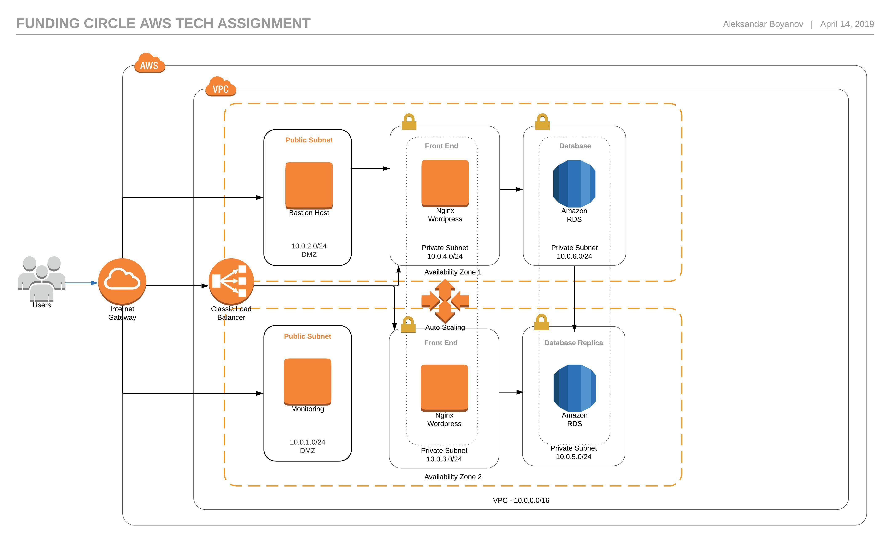

# Funding Circle Tech Assignment

Here we will build the Infrastructure for Highly-Available WordPress website over AWS using Terraform and then install the WordPress using Ansible. 

We’ll use the Terraform to create the fully operational AWS VPC infrastructure(subnets,routeing tables,igw etc), it will also create everything that need to be for creating EC2 and RDS instances (security key, security group, subnet group). It will also create the Elastic Load Balancer and add the EC2 instance(s) automatically to it.

### Requirements:

	- Terraform
	- Ansible
	- AWS admin access
	- AWS CLI
	
Before using the terraform, we need to export AWS_ACCESS_KEY_ID and AWS_SECRET_ACCESS_KEY as environment variables:
```bash
export AWS_ACCESS_KEY_ID="xxxxxxxxxxxxxxxx"
export AWS_SECRET_ACCESS_KEY="yyyyyyyyyyyyyyyyyyyy"
```

Clone this repo
```bash
git clone https://github.com/Alexsa6ko94/fc-tech-assignment.git
cd fc-tech-assignment/aws-terraform
```
Rename the file called terraform.tfvars.sample into the terraform.tfvars and change the values as per your requirement:
```bash
mv terraform.tfvars-sample terraform.tfvars
```
DRY run
```bash
terraform plan
```
To builds or makes actual changes in infrastructure:
```bash
terraform apply
```
To destroy Terraform-managed infrastructure:
terraform destroy

Here is an infrastructure diagram.



### Terraform will:

	- Create  VPC with 6 x VPC subnets(2 x public, 4 x private) in different AZ zones inside the AWS region
	- Create the AWS key pair with the provided public key
	- Create 1 x security group for each(Bastion, Webservers, RDS and ELB)
	- Provision 3 x EC2 instances: Bastion/dev, Webserver and Monitoring instance
	- Provision 1 x RDS instance in private subnets / Optionally can launch and RDS replica
	- Launch and configure public facing VPC ELB (cross_az_load_balancing) and attach VPC subnets
	- Register EC2 instances on ELB
	- It will bake AMI from dev instance that will be used by the autoscaling group
	
### Ansible will:
	
	- Install and configure the Wordpress, nginx, nagios, kibana, ELK
	- Install and configure nginx 


### High Availability
To achieve HA we'll span our autoscaling group in two different availability zones. 

### Security
We use a dedicated VPC for our project, associate restrictive security groups to instances and put our EC2 instances, DB services in private subnets. SSH access to the EC2 instances only from The Bastion instance. We have additinal instance for Monitoring. Connection to the DB can originate only from the Webserver.

### Disaster Recovery
Sync wordpress files to the S3 code bucket.

RDS service gives you automatic backups of the Database


### What could be done better:

	- There is still a little manual work for the monitoring
	- Separate the terraform in different reusable modules
	- Use terragrunt as a wrapper
	- Store the terraform state on S3 and locks in DB
	- Use AWS IAM Roles for additional layer
	
